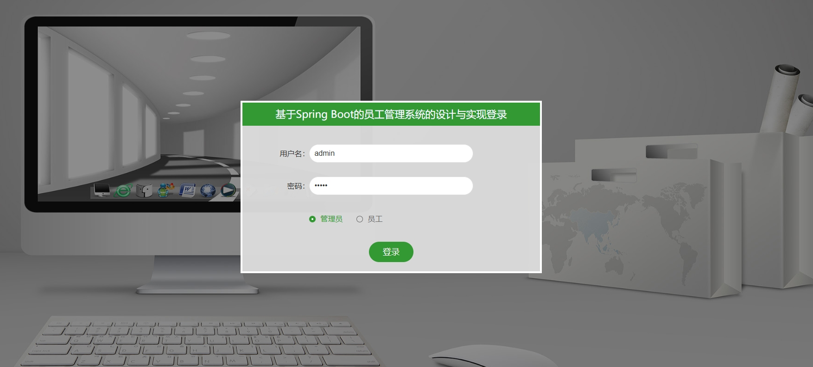
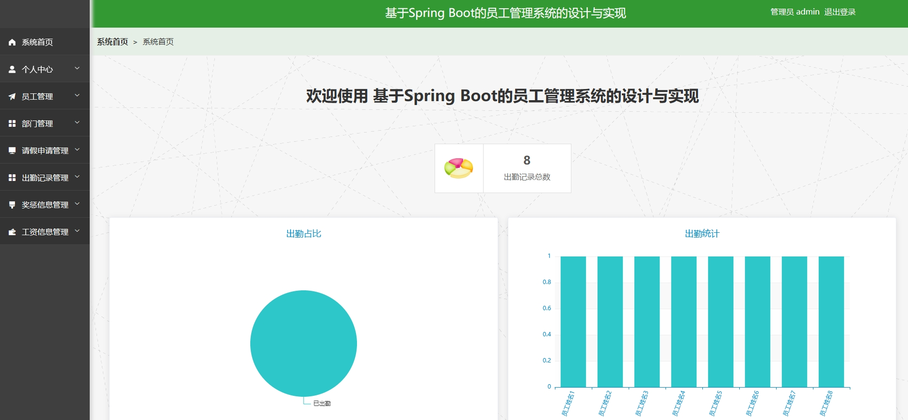
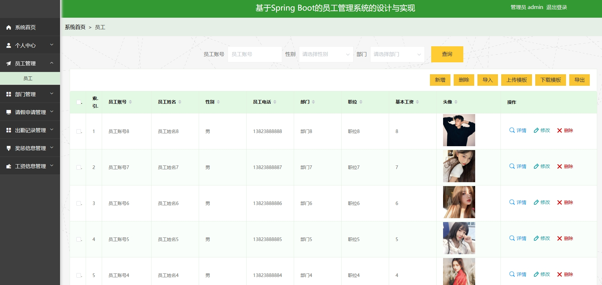
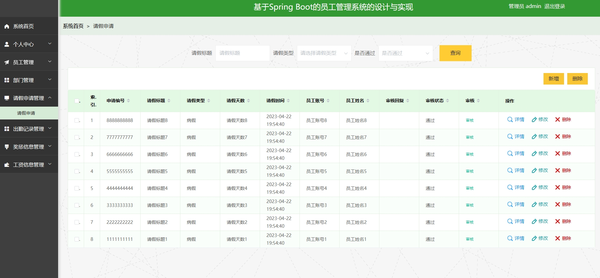
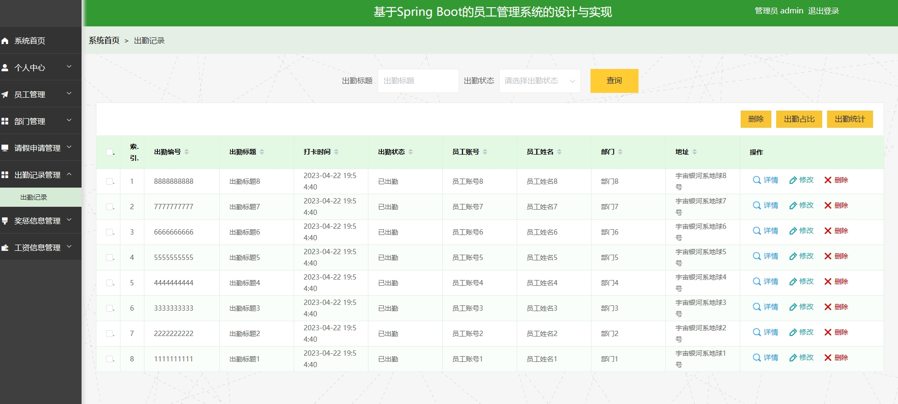
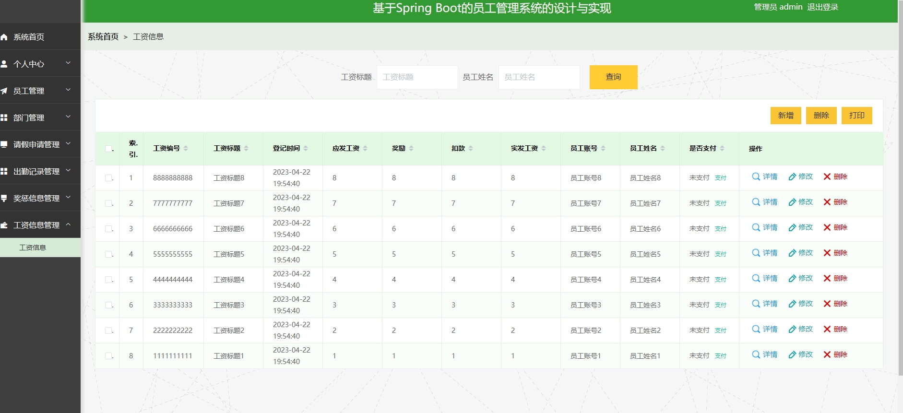
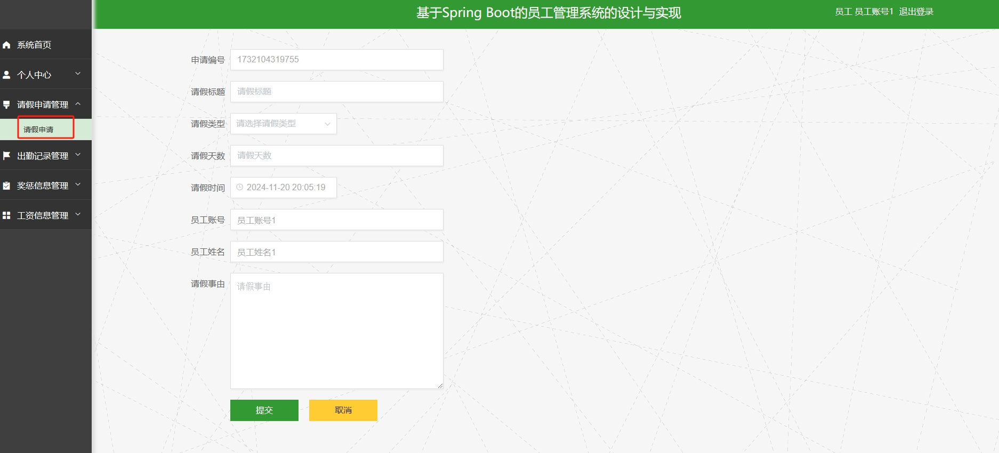
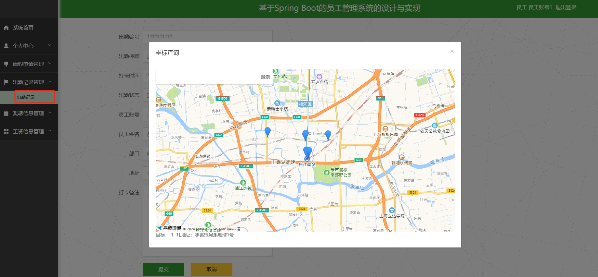
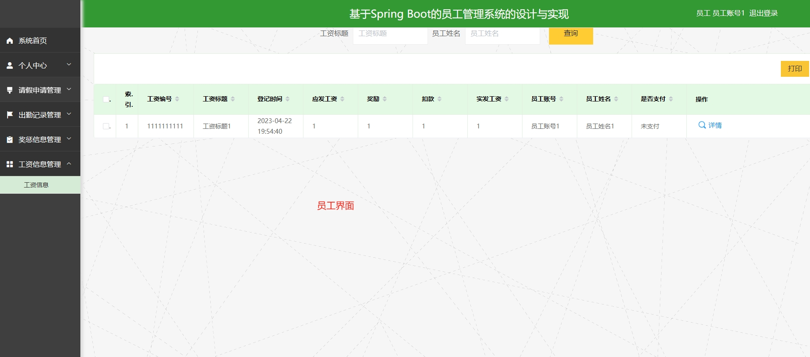
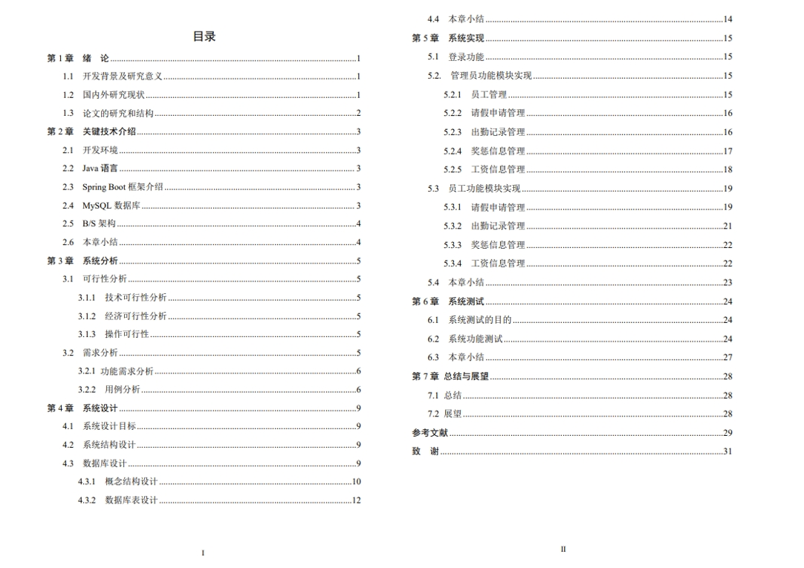

# 1.项目介绍
- 功能模块：管理员（员工管理、部门管理、请假申请管理、出勤记录管理、奖惩信息管理、工资信息管理等）、员工/普通用户（请假申请、出勤、奖惩信息查看、工资信息查看等）
- 技术选型：SpringBoot、vue等
- 测试环境：idea2024，mysql5.7，jdk1.8，maven3等
# 2.项目部署
- 创建数据库，导入db下的sql文件
- 通过idea打开项目，根据 本地数据库环境修改src/main/resources/application.yml 12-15行
- 启动项目，src/main/java/com/SpringbootSchemaApplication.java
- 访问：http://localhost:8080/springboote45z9/admin/dist/index.html，管理员账号密码：admin/admin，员工账号密码：员工账号1/123456，或查看表
- 说明：上一步中的dist是vue项目编译后的内容，可以直接访问。Vue的项目在src/main/resources/admin/admin，如果你想做一些修改，可以给idea安装vue.js的插件直接进行开发，或者通过vscode等工具进行开发
# 3.项目部分截图

